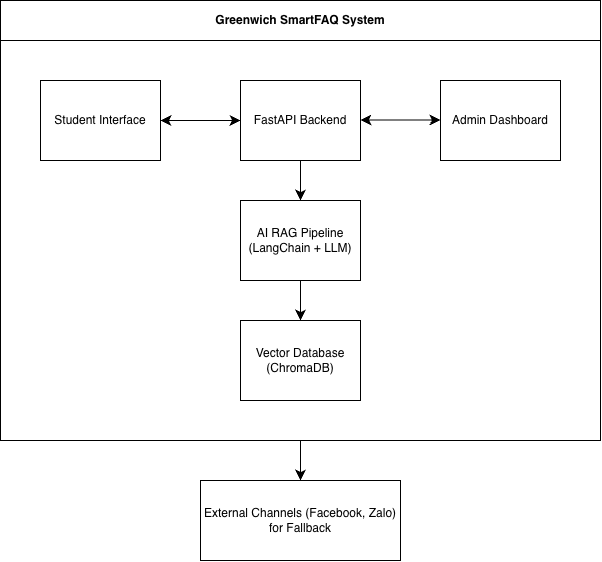
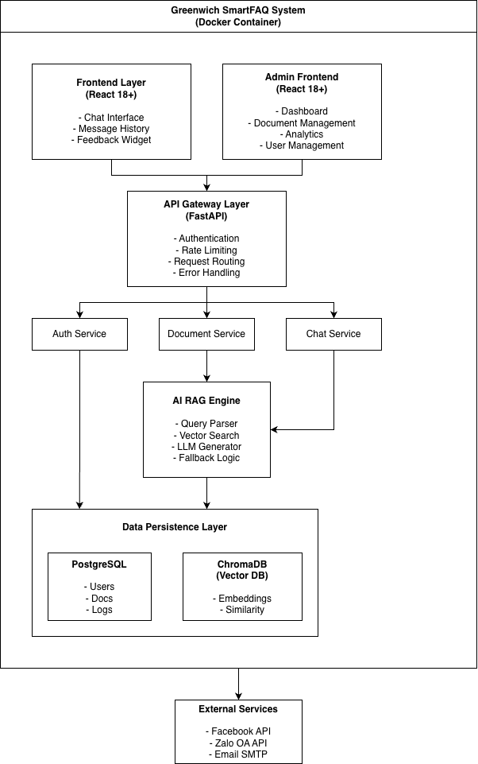
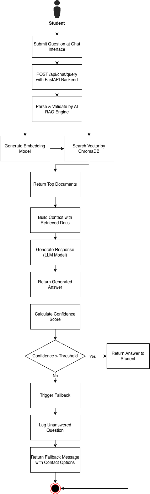

**Software** **Requirements** **Specification**

Greenwich SmartFAQ System

**Version** **1.0**

**Prepared** **by:** **Trang** **Le** **–** **Business** **Analyst,**
**DevPlus**

**Date:** **October** **23,** **2025**

***Software*** ***Requirements*** ***Specification*** ***for***
***Greenwich*** ***SmartFAQ***

**Table** **of** **Contents**

**1.** **Introduction** **1** **1.1** **Purpose** **1** **1.2**
**Document** **Conventions** **1** **1.3** **Project** **Scope** **1**
**1.4** **References** **2**

**2.** **Overall** **Description** **3** **2.1** **Product**
**Perspective** **3** **2.2** **Product** **Features** **4** **2.3**
**User** **Classes** **and** **Characteristics** **5** **2.4**
**Operating** **Environment** **6** **2.5** **Assumptions** **and**
**Dependencies** **6**

**3.** **Functional** **Requirements** **7** **3.1** **User**
**Authentication** **and** **Access** **Control** **7** **3.1.1**
**Description** **and** **Priority** **7**

> **3.1.2** **Functional** **Requirements** **7** **3.2** **Document**
> **Management** **System** **8**
>
> 3.2.1 Description and Priority 8 3.2.2 Functional Requirements 8
>
> **3.3** **AI-Powered** **Chatbot** **Engine** **10** 3.3.1 Description
> and Priority 10 3.3.2 Functional Requirements 10
>
> **3.4** **Smart** **Fallback** **Mechanism** **11** 3.4.1 Description
> and Priority 11 3.4.2 Functional Requirements 11
>
> **3.5** **Student** **Web** **Interface** **13** 3.5.1 Description and
> Priority 13 3.5.2 Functional Requirements 13
>
> **3.6** **Admin** **Dashboard** **and** **Monitoring** **14** 3.6.1
> Description and Priority 14 3.6.2 Functional Requirements 14
>
> **3.7** **Multi-Language** **Support** **16** 3.7.1 Description and
> Priority 16 3.7.2 Functional Requirements 16
>
> **3.8** **Integration** **with** **External** **Channels** **16**
> 3.8.1 Description and Priority 16 3.8.2 Functional Requirements 17

**4.** **Nonfunctional** **Requirements** **17**

***Software*** ***Requirements*** ***Specification*** ***for***
***Greenwich*** ***SmartFAQ***

> **4.1** **Performance** **Requirements** **17** **4.2** **Safety**
> **Requirements** **18** **4.3** **Security** **Requirements** **19**
> **4.4** **Software** **Quality** **Attributes** **20**

**5.** **Other** **Requirements** **22** **5.1** **Legal** **and**
**Compliance** **Requirements** **22** **5.2** **Operational**
**Requirements** **22** **5.3** **Training** **and** **Support**
**Requirements** **23** **5.4** **Development** **Requirements** **23**

***Software*** ***Requirements*** ***Specification*** ***for***
***Greenwich*** ***SmartFAQ***

> **Revision** **History**

||
||
||
||
||

> ***Software*** ***Requirements*** ***Specification*** ***for***
> ***Greenwich*** ***SmartFAQ***

**1.** **Introduction**

**1.1** **Purpose**

This Software Requirements Specification (SRS) document provides a
complete description of the functional and non-functional requirements
for the Greenwich SmartFAQ System, Version 1.0. This system is an
intelligent FAQ chatbot designed to provide Greenwich University
students with 24/7 access to academic and administrative information
while reducing repetitive workloads for the Student Affairs Department.

The SRS is intended for:

> \- Development team members (DevPlus interns and technical mentors)
>
> \- Project stakeholders (Greenwich University administration and
> Student Affairs Department staff)
>
> \- Quality assurance and testing teams
>
> \- System maintenance and support personnel

**1.2** **Document** **Conventions**

This SRS follows these conventions:

> \- **Functional** **Requirements** are prefixed with "FR-" followed by
> a three-digit number (e.g., FR-001)
>
> \- **Non-Functional** **Requirements** are prefixed with "NFR-"
> followed by a three-digit number (e.g., NFR-001)
>
> \- **Priority** **Levels** are indicated as:
>
> \- **High**: Critical for Phase 1 release
>
> \- **Medium**: Important but can be deferred to Phase 2 - **Low**:
> Nice-to-have features for future releases
>
> \- **Bold** **text** indicates key terms and important information
>
> \- *Italic* *text* indicates technical terminology or system
> components
>
> \- \`Code formatting\` is used for technical specifications, file
> formats, and API references

All requirements inherit the priority of their parent module unless
explicitly stated otherwise.

**1.3** **Project** **Scope**

The Greenwich SmartFAQ System is an intelligent, AI-powered FAQ chatbot
designed to enhance student support services at Greenwich University.
The system aims to:

***Software*** ***Requirements*** ***Specification*** ***for***
***Greenwich*** ***SmartFAQ***

> **Primary** **Objectives:**
>
> \- Provide students with instant, 24/7 access to academic and
> administrative information - Reduce repetitive inquiry workloads for
> the Student Affairs Department
>
> \- Deliver an intelligent, scalable, and user-friendly conversational
> experience
>
> **Key** **Benefits:**
>
> \- Improved student satisfaction through instant responses
>
> \- Reduced operational costs for Student Affairs Department staff -
> Centralized knowledge management system
>
> \- Data-driven insights into student inquiries and concerns
>
> **System** **Boundaries:**
>
> The system consists of three main components:
>
> 1\. **Admin** **Dashboard** **(Backend)**: Document management and
> system monitoring for Student Affairs Department staff

2\. **Student** **Interface** **(Frontend)**: Web application or chatbot
for student interactions 3. **AI** **RAG** **Pipeline**: Intelligent
question-answering engine using open-source LLMs

> **Out** **of** **Scope:**
>
> \- Integration with OpenAI or other commercial AI APIs
>
> \- Cloud-based deployment (system will be on-premise only)
>
> \- Student information system (SIS) integration (future
> consideration) - Grade or transcript queries (security considerations)
>
> This project aligns with Greenwich University's strategic goals of
> digital transformation and enhanced student services.
>
> **1.4** **References**

||
||
||
||
||
||
||
||

> ***Software*** ***Requirements*** ***Specification*** ***for***
> ***Greenwich*** ***SmartFAQ***

||
||
||

> **2.** **Overall** **Description**
>
> **2.1** **Product** **Perspective**
>
> The Greenwich SmartFAQ System is a new, self-contained product
> developed specifically for Greenwich University. It operates as an
> intelligent question-answering system that bridges the gap between
> students seeking information and the Student Affairs Department.
>
> **System** **Context:**
>
> The system will be deployed on-premise at Greenwich University and
> consists of the following major components:
>
> **External** **Interfaces:**
>
> ***Software*** ***Requirements*** ***Specification*** ***for***
> ***Greenwich*** ***SmartFAQ***
>
> \- **User** **Interfaces**: Web application (React), potential future
> integration with Facebook Messenger
>
> \- **Hardware** **Interfaces**: On-premise server infrastructure
> (Linux/Ubuntu)
>
> \- **Software** **Interfaces**: ChromaDB for vector storage,
> PostgreSQL for metadata (if needed)
>
> \- **Communication** **Interfaces**: REST API (FastAPI), Facebook
> Messenger API, Zalo OA API (future)

**Memory** **and** **Storage:**

> \- Document storage for uploaded FAQ materials - Vector embeddings in
> ChromaDB
>
> \- User query logs and chat history - System audit logs

**2.2** **Product** **Features**

The Greenwich SmartFAQ System provides the following major features:

**F1.** **Intelligent** **Question** **Answering**

> \- Natural language understanding of student questions
>
> \- Context-aware responses based on uploaded university documents
>
> \- Multi-language support (English primary, expandable to Vietnamese
> and other languages) - Conversation history tracking

**F2.** **Document** **Management** **System**

> \- Upload multiple file formats (TXT, DOCX, PDF, images) - Document
> version control and updates
>
> \- Bulk document upload capability
>
> \- Document categorization and tagging

**F3.** **Admin** **Dashboard**

> \- User authentication and access control
>
> \- Document upload and management interface - Query monitoring and
> analytics
>
> \- Report generation (frequently asked questions, usage statistics) -
> System configuration and settings

**F4.** **Smart** **Fallback** **Mechanism**

> \- Automatic detection of unanswerable questions - Intelligent routing
> to human support channels
>
> \- Configurable fallback destinations (Facebook, Zalo, email) -
> Fallback notification to Student Affairs Department staff

***Software*** ***Requirements*** ***Specification*** ***for***
***Greenwich*** ***SmartFAQ***

**F5.** **Student** **Web** **Interface**

> \- Clean, intuitive chat interface - Real-time response delivery
>
> \- Chat history access
>
> \- Mobile-responsive design

**F6.** **AI** **RAG** **Pipeline**

> \- Document processing and chunking - Vector embedding generation
>
> \- Semantic search capabilities
>
> \- Response generation using open-source LLMs

**2.3** **User** **Classes** **and** **Characteristics**

**UC1:** **Students** **(Primary** **Users)**

\- **Frequency** **of** **Use**: Daily to weekly

\- **Technical** **Expertise**: Basic to intermediate computer/mobile
device users - **Primary** **Functions**: Ask questions, view chat
history

\- **Characteristics**:

> \- Familiar with chat interfaces and social media - May have limited
> time between classes
>
> \- Need quick, accurate information

\- **Favored** **User** **Class**: Yes (system optimized for student
experience)

**UC2:** **Student** **Affairs** **Department** **Staff**
**(Administrative** **Users)** - **Frequency** **of** **Use**: Daily

\- **Technical** **Expertise**: Intermediate computer users, basic
technical knowledge

\- **Primary** **Functions**: Upload documents, manage FAQ content,
monitor queries, generate reports - **Characteristics**:

> \- Responsible for student support services
>
> \- Need efficient tools for content management
>
> \- Require visibility into system performance and student queries -
> May need training on system features

\- **Favored** **User** **Class**: Yes (system success depends on
Student Affairs Department adoption)

**UC3:** **System** **Administrators** **(DevPlus/IT** **Staff)** -
**Frequency** **of** **Use**: As needed for maintenance

\- **Technical** **Expertise**: Advanced technical knowledge

\- **Primary** **Functions**: System deployment, maintenance,
troubleshooting, updates - **Characteristics**:

***Software*** ***Requirements*** ***Specification*** ***for***
***Greenwich*** ***SmartFAQ***

> \- Responsible for system uptime and performance - Need access to
> system logs and diagnostics
>
> \- May need to configure AI models and parameters

**UC4:** **Project** **Stakeholders** **(Greenwich** **Management)** -
**Frequency** **of** **Use**: Periodic reviews

\- **Technical** **Expertise**: Varies

\- **Primary** **Functions**: Review reports, assess system
effectiveness - **Characteristics**:

> \- Decision-makers for system expansion and budget - Focus on ROI and
> student satisfaction metrics

**2.4** **Operating** **Environment**

**Hardware** **Environment:**

> \- **Server**: On-premise Linux/Ubuntu server
>
> \- Minimum: 16GB RAM, 8 CPU cores, 500GB storage
>
> \- Recommended: 32GB RAM, 16 CPU cores, 1TB SSD storage - GPU support
> preferred for AI model inference

**Software** **Environment:**

> \- **Operating** **System**: Ubuntu 20.04 LTS or higher
>
> \- **Containerization**: Docker Desktop / Docker Engine - **Runtime**:
> Python 3.10+, Node.js 18+
>
> \- **Database**: ChromaDB (vector store), PostgreSQL 14+ (optional
> metadata) - **Web** **Server**: Nginx (reverse proxy)

**Client** **Environment:**

> \- **Web** **Browsers**: Chrome 90+, Firefox 88+, Safari 14+, Edge
> 90+ - **Mobile** **Browsers**: iOS Safari, Android Chrome
>
> \- **Minimum** **Screen** **Resolution**: 320px width (mobile), 1024px
> (desktop) - **Internet** **Connection**: Stable broadband or mobile
> data connection

**Development** **Environment:**

> \- **Version** **Control**: GitHub or GitLab
>
> \- **IDE**: Visual Studio Code, PyCharm (recommended)
>
> \- **Package** **Managers**: pip (Python), npm/yarn (JavaScript)

**Integration** **Environment:**

> \- Must coexist with existing university network infrastructure
>
> \- Firewall configuration for external API access (Facebook, Zalo)

***Software*** ***Requirements*** ***Specification*** ***for***
***Greenwich*** ***SmartFAQ***

> \- HTTPS/SSL certificate for secure communication

**2.5** **Assumptions** **and** **Dependencies**

**Assumptions:**

> 1\. Greenwich University will provide adequate on-premise server
> infrastructure
>
> 2\. Student Affairs Department staff will allocate time for initial
> document upload and system training
>
> 3\. Students have access to internet-connected devices (computers or
> smartphones) 4. University documents are available in digital formats
> (PDF, DOCX, etc.)
>
> 5\. Open-source LLMs can provide acceptable response quality without
> OpenAI 6. Network infrastructure can support 1,000+ concurrent users
>
> 7\. Student Affairs Department staff can provide timely responses
> through fallback channels

**Dependencies:**

> 1\. **Open-Source** **LLM** **Models**: System depends on availability
> and performance of models like LLaMA, Mistral, or similar
>
> 2\. **LangChain** **Framework**: RAG pipeline implementation relies on
> LangChain stability 3. **ChromaDB**: Vector storage functionality
> depends on ChromaDB reliability
>
> 4\. **Docker**: Containerization and deployment require Docker
> availability 5. **External** **APIs** (Future):
>
> \- Facebook Messenger API for chatbot integration - Zalo OA API for
> Vietnamese messaging support
>
> 6\. **Hardware** **Resources**: AI model performance depends on
> adequate server specifications 7. **Document** **Quality**: Answer
> quality depends on completeness and accuracy of uploaded
>
> documents
>
> 8\. **Network** **Connectivity**: System requires stable internet for
> external fallback channels 9. **Browser** **Compatibility**: Frontend
> depends on modern browser support for React 18+
>
> 10\. **DevPlus** **Resources**: Development timeline depends on intern
> team availability and mentor guidance

**Risks** **if** **Assumptions** **are** **Incorrect:**

> \- Inadequate server resources may result in slow response times or
> system instability - Poor document quality will lead to inaccurate or
> incomplete answers
>
> \- Limited Student Affairs Department engagement may result in
> outdated or insufficient FAQ content
>
> \- Open-source LLM limitations may necessitate significant fine-tuning
> or model changes

***Software*** ***Requirements*** ***Specification*** ***for***
***Greenwich*** ***SmartFAQ***

**3.** **Functional** **Requirements**

**3.1** **User** **Authentication** **and** **Access** **Control**

**3.1.1** **Description** **and** **Priority**

**Priority**: High

This module handles user authentication and role-based access control
for the Admin Dashboard. It ensures that only authorized Student Affairs
Department staff can access administrative functions while students can
freely access the chatbot interface without authentication.

**3.1.2** **Functional** **Requirements**

**FR-001:** **Admin** **Login**

> \- The system shall provide a secure login page for Student Affairs
> Department staff to access the Admin Dashboard
>
> \- The system shall require username and password credentials
>
> \- The system shall implement password encryption using
> industry-standard hashing algorithms (bcrypt or similar)
>
> \- The system shall lock accounts after 5 consecutive failed login
> attempts
>
> \- The system shall maintain login session for 8 hours or until
> explicit logout

**FR-002:** **Role-Based** **Access** **Control**

> \- The system shall support the following user roles:
>
> \- **Super** **Admin**: Full system access including user management
>
> \- **Student** **Affairs** **Department** **Staff**: Document
> management and query monitoring - **Viewer**: Read-only access to
> reports and analytics
>
> \- The system shall restrict access to features based on assigned user
> roles
>
> \- The system shall log all access attempts with timestamp and user
> identification

**FR-003:** **Password** **Management**

> \- The system shall allow users to change their passwords
>
> \- The system shall enforce password complexity requirements: -
> Minimum 8 characters
>
> \- At least one uppercase letter - At least one number
>
> \- At least one special character
>
> \- The system shall provide a "Forgot Password" recovery mechanism

**FR-004:** **Session** **Management**

***Software*** ***Requirements*** ***Specification*** ***for***
***Greenwich*** ***SmartFAQ***

> \- The system shall provide a "Remember Me" option to extend session
> duration to 30 days - The system shall display session timeout
> warnings 2 minutes before expiration
>
> \- The system shall allow users to explicitly log out from any page

**FR-005:** **Student** **Access** **(Unauthenticated)**

> \- The system shall allow students to access the chatbot interface
> without login
>
> \- The system shall optionally allow students to provide their student
> ID for personalized experience (future enhancement)
>
> \- The system shall maintain anonymous chat sessions using browser
> cookies or session storage

**3.2** **Document** **Management** **System**

**3.2.1** **Description** **and** **Priority**

**Priority**: High

This module enables CTSV staff to upload, manage, and organize
university documents that serve as the knowledge base for the AI
chatbot. It supports multiple file formats and provides version control
capabilities.

**3.2.2** **Functional** **Requirements**

**FR-006:** **Document** **Upload**

> \- The system shall support uploading the following file formats: -
> Text files (.txt)
>
> \- Microsoft Word documents (.doc, .docx) - PDF files (.pdf)
>
> \- Image files (.jpg, .jpeg, .png) with OCR capability
>
> \- The system shall accept individual file uploads up to 50MB
>
> \- The system shall support bulk upload of multiple files
> simultaneously (up to 10 files) - The system shall provide
> drag-and-drop upload functionality
>
> \- The system shall display upload progress indicators

**FR-007:** **Document** **Processing**

> \- The system shall automatically extract text content from uploaded
> documents - The system shall perform OCR (Optical Character
> Recognition) on image files
>
> \- The system shall split large documents into semantically meaningful
> chunks for vector embedding
>
> \- The system shall generate vector embeddings for document content
> using open-source embedding models
>
> \- The system shall store embeddings in ChromaDB vector database

***Software*** ***Requirements*** ***Specification*** ***for***
***Greenwich*** ***SmartFAQ***

**FR-008:** **Document** **Metadata** **Management**

> \- The system shall allow Student Affairs Department staff to add
> metadata to documents: - Document title
>
> \- Category (e.g., Admissions, Academic Policies, Student Services,
> etc.) - Tags/Keywords
>
> \- Language (English, Vietnamese, etc.) - Effective date
>
> \- Expiration date (optional)
>
> \- The system shall automatically capture: - Upload timestamp
>
> \- Uploaded by (user ID) - File size
>
> \- File format

**FR-009:** **Document** **Listing** **and** **Search**

> \- The system shall display a paginated list of all uploaded
> documents - The system shall allow filtering documents by:
>
> \- Category
>
> \- Upload date range - File format
>
> \- Upload user
>
> \- The system shall provide keyword search functionality across
> document titles and metadata - The system shall display document
> details including metadata and upload information

**FR-010:** **Document** **Update** **and** **Versioning**

> \- The system shall allow Student Affairs Department staff to
> re-upload updated versions of existing documents
>
> \- The system shall maintain version history for all documents
>
> \- The system shall allow comparison between document versions - The
> system shall allow reverting to previous document versions
>
> \- The system shall automatically re-process and re-embed updated
> documents

**FR-011:** **Document** **Deletion**

> \- The system shall allow authorized users to delete documents
>
> \- The system shall require confirmation before document deletion
>
> \- The system shall perform soft deletion (archive) by default,
> retaining documents for 30 days - The system shall allow permanent
> deletion by Super Admin only
>
> \- The system shall automatically remove vector embeddings associated
> with deleted documents

***Software*** ***Requirements*** ***Specification*** ***for***
***Greenwich*** ***SmartFAQ***

**FR-012:** **Document** **Status** **Management**

> \- The system shall support document statuses:
>
> \- **Active**: Available for chatbot responses - **Draft**: Uploaded
> but not yet active
>
> \- **Archived**: No longer used for responses but retained for
> reference
>
> \- The system shall allow Student Affairs Department staff to change
> document status - The system shall only use "Active" documents for
> generating chatbot responses

**3.3** **AI-Powered** **Chatbot** **Engine**

**3.3.1** **Description** **and** **Priority**

**Priority**: High

This is the core module that handles student questions using RAG
(Retrieval-Augmented Generation) architecture with open-source LLMs. It
retrieves relevant information from the knowledge base and generates
accurate, context-aware responses.

**3.3.2** **Functional** **Requirements**

**FR-013:** **Question** **Understanding**

> \- The system shall accept text-based questions from students in
> natural language - The system shall support questions up to 500
> characters in length
>
> \- The system shall handle common variations of questions (synonyms,
> different phrasings) - The system shall detect the language of the
> question (English, Vietnamese, etc.)
>
> \- The system shall perform query preprocessing (spell correction,
> normalization)

**FR-014:** **RAG** **Pipeline** **-** **Retrieval**

> \- The system shall convert user questions into vector embeddings
>
> \- The system shall perform semantic search against the ChromaDB
> vector database - The system shall retrieve the top 5 most relevant
> document chunks
>
> \- The system shall rank retrieved chunks by relevance score (cosine
> similarity)
>
> \- The system shall filter out chunks with relevance scores below a
> configurable threshold (default: 0.7)

**FR-015:** **RAG** **Pipeline** **-** **Answer** **Generation**

> \- The system shall use an open-source LLM (e.g., LLaMA, Mistral,
> Vicuna) for answer generation
>
> \- The system shall generate responses based on retrieved document
> context - The system shall provide answers in the same language as the
> question
>
> \- The system shall limit generated responses to 300 words maximum

***Software*** ***Requirements*** ***Specification*** ***for***
***Greenwich*** ***SmartFAQ***

> \- The system shall format responses in clear, student-friendly
> language
>
> \- The system shall avoid generating information not found in the
> knowledge base (no hallucination)

**FR-016:** **Response** **Confidence** **Scoring**

> \- The system shall calculate a confidence score (0-100%) for each
> generated answer - The confidence score shall be based on:
>
> \- Semantic similarity of retrieved documents (50% weight) - Number of
> relevant documents found (20% weight)
>
> \- LLM generation confidence (30% weight)
>
> \- The system shall include confidence score in response metadata (not
> displayed to students)

**FR-017:** **Multi-turn** **Conversation** **Support**

> \- The system shall maintain conversation context for up to 5 previous
> exchanges - The system shall use conversation history to understand
> follow-up questions
>
> \- The system shall allow students to ask clarifying questions
>
> \- The system shall start a new conversation context when explicitly
> requested ("new conversation", "start over")

**FR-018:** **Response** **Formatting**

> \- The system shall format responses with proper paragraphs and line
> breaks - The system shall support basic formatting:
>
> \- Bullet points for lists
>
> \- Numbered steps for procedures - Bold text for emphasis
>
> \- The system shall include relevant document references (titles) at
> the end of responses when appropriate

**FR-019:** **Source** **Attribution**

> \- The system shall track which documents were used to generate each
> response - The system shall optionally display source document titles
> to students
>
> \- The system shall log source documents for Student Affairs
> Department review and quality assurance

**3.4** **Smart** **Fallback** **Mechanism**

**3.4.1** **Description** **and** **Priority**

**Priority**: High

***Software*** ***Requirements*** ***Specification*** ***for***
***Greenwich*** ***SmartFAQ***

This module automatically detects when the chatbot cannot provide a
satisfactory answer and redirects students to human support channels
(Facebook, Zalo, email) for assistance.

**3.4.2** **Functional** **Requirements**

**FR-020:** **Fallback** **Trigger** **Detection**

> \- The system shall trigger fallback when:
>
> \- No relevant documents are found (all relevance scores \<
> threshold) - Generated answer confidence score is below 60%
>
> \- Student explicitly requests human assistance ("talk to a person",
> "contact support") - Student expresses dissatisfaction with the answer
> ("not helpful", "wrong answer")
>
> \- The system shall analyze consecutive failed queries (3+ in a row)
> as fallback trigger

**FR-021:** **Fallback** **Channel** **Configuration**

> \- The system shall support multiple fallback channels:
>
> \- Facebook Messenger (link to Student Affairs Department page) - Zalo
> OA (link to Student Affairs Department official account)
>
> \- Email (display Student Affairs Department contact email) - Phone
> (display Student Affairs Department phone number)
>
> \- The system shall allow Student Affairs Department staff to
> configure available fallback channels
>
> \- The system shall allow setting default fallback channel
>
> \- The system shall allow prioritization of fallback channels

**FR-022:** **Fallback** **Response**

> \- The system shall generate a friendly fallback message, such as:
> "*I* *couldn't* *find* *a* *confident* *answer* *to* *your* *question*
> *in* *our* *knowledge* *base.* *Let* *me* *connect* *you* *with* *our*
> *Student* *Affairs* *team* *for* *personalized* *assistance*."
>
> \- The system shall display available contact options (Facebook, Zalo,
> Email, Phone) - The system shall provide clickable links to external
> channels (Facebook, Zalo)
>
> \- The system shall allow students to copy contact information (email,
> phone)

**FR-023:** **Fallback** **Logging**

> \- The system shall log all fallback occurrences with: - Original
> question
>
> \- Timestamp
>
> \- Fallback reason (no relevant docs, low confidence, user request) -
> Selected fallback channel (if tracked)
>
> \- The system shall create a "Unanswered Questions" report for Student
> Affairs Department review

***Software*** ***Requirements*** ***Specification*** ***for***
***Greenwich*** ***SmartFAQ***

> \- The system shall allow Student Affairs Department staff to mark
> fallback questions as addressed or create new FAQ content

**FR-024:** **Fallback** **Notification**

> \- The system shall optionally send notifications to Student Affairs
> Department staff when fallback is triggered (configurable threshold,
> e.g., 5+ per hour)
>
> \- Notifications shall include:
>
> \- Number of fallback occurrences in the last hour - Top unanswered
> questions
>
> \- Link to view detailed fallback logs

**3.5** **Student** **Web** **Interface**

**3.5.1** **Description** **and** **Priority**

**Priority**: High

This module provides the front-end chat interface for students to
interact with the SmartFAQ chatbot. It must be intuitive, responsive,
and accessible on both desktop and mobile devices.

**3.5.2** **Functional** **Requirements**

**FR-025:** **Chat** **Interface** **Design**

> \- The system shall provide a modern, chat-style interface similar to
> popular messaging apps - The system shall display student messages on
> the right side and bot responses on the left
>
> \- The system shall use distinct colors to differentiate student and
> bot messages - The system shall display timestamps for each message
>
> \- The system shall show typing indicators while the bot is generating
> a response - The system shall automatically scroll to the latest
> message

**FR-026:** **Message** **Input**

> \- The system shall provide a text input field for students to type
> questions - The system shall support multi-line input (up to 500
> characters)
>
> \- The system shall display character count as student types
>
> \- The system shall provide a "Send" button to submit questions
>
> \- The system shall allow submission using "Enter" key (desktop) or
> "Send" button (mobile) - The system shall disable input field and send
> button while waiting for bot response

**FR-027:** **Quick** **Actions** **and** **Suggestions**

> \- The system shall display welcome message with sample questions when
> conversation starts - The system shall provide quick action buttons
> for common questions:
>
> \- "Admission requirements"

***Software*** ***Requirements*** ***Specification*** ***for***
***Greenwich*** ***SmartFAQ***

> \- "Tuition fees"
>
> \- "Academic calendar" - "Student services"
>
> \- The system shall suggest related questions based on current topic
>
> \- The system shall allow customization of quick action buttons by
> Student Affairs Department staff

**FR-028:** **Chat** **History**

> \- The system shall maintain chat history for the current session
> (stored in browser) - The system shall allow students to scroll up to
> view previous messages
>
> \- The system shall display up to 50 messages per session
>
> \- The system shall allow students to clear chat history (start new
> conversation)
>
> \- The system shall optionally support persistent chat history across
> sessions (future: requires student login)

**FR-029:** **Response** **Interaction**

> \- The system shall display "Was this helpful?" feedback buttons
> (thumbs up/down) for each bot response
>
> \- The system shall allow students to copy bot responses to clipboard
>
> \- The system shall allow students to share responses via social media
> (future enhancement) - The system shall provide a "Get Help from
> Student Affairs Department" button on each
>
> response for easy fallback access

**FR-030:** **Mobile** **Responsiveness**

> \- The system shall be fully functional on mobile devices (iOS and
> Android) - The system shall adapt layout for screen sizes from 320px
> to 1920px width
>
> \- The system shall provide touch-friendly buttons (minimum 44x44px
> tap targets) - The system shall handle mobile keyboard display without
> breaking layout
>
> \- The system shall support both portrait and landscape orientations

**3.6** **Admin** **Dashboard** **and** **Monitoring**

**3.6.1** **Description** **and** **Priority**

**Priority**: High

This module provides Student Affairs Department staff with tools to
monitor chatbot usage, analyze student queries, manage system settings,
and generate reports.

**3.6.2** **Functional** **Requirements**

**FR-033:** **Dashboard** **Overview**

***Software*** ***Requirements*** ***Specification*** ***for***
***Greenwich*** ***SmartFAQ***

> \- The system shall display a dashboard with key metrics:
>
> \- Total questions asked (today, this week, this month) - Average
> response time
>
> \- Fallback rate (percentage)
>
> \- User satisfaction rate (based on feedback) - Active documents count
>
> \- The system shall display metric trends with line charts
>
> \- The system shall allow customizable date range selection
>
> \- The system shall refresh metrics every 5 minutes automatically

**FR-034:** **Query** **Log** **Viewer**

> \- The system shall display a searchable, paginated log of all student
> questions - Each log entry shall include:
>
> \- Question text - Timestamp
>
> \- Response generated - Confidence score
>
> \- Response time (ms)
>
> \- Fallback triggered (yes/no)
>
> \- User feedback (thumbs up/down) - Source documents used
>
> \- The system shall support filtering by: - Date range
>
> \- Confidence score range - Fallback status
>
> \- User feedback - Language
>
> \- The system shall allow exporting filtered logs to CSV format

**FR-035:** **Frequently** **Asked** **Questions** **Report**

> \- The system shall analyze query logs to identify frequently asked
> questions
>
> \- The system shall display top 20 most common questions (by semantic
> similarity, not exact match)
>
> \- The system shall show frequency count for each question
>
> \- The system shall allow grouping similar questions together
>
> \- The system shall provide "Create FAQ Document" button to convert
> frequent questions into new knowledge base content

**FR-036:** **Unanswered** **Questions** **Report**

> \- The system shall list all questions that triggered fallback
> mechanism

***Software*** ***Requirements*** ***Specification*** ***for***
***Greenwich*** ***SmartFAQ***

> \- The system shall group similar unanswered questions
>
> \- The system shall display frequency and last occurrence date - The
> system shall allow Student Affairs Department staff to:
>
> \- Mark questions as "In Progress" or "Resolved" - Add notes about
> resolution plan
>
> \- Link to newly created documents that address the question
>
> \- The system shall send weekly digest of unanswered questions to
> Student Affairs Department staff email

**FR-037:** **User** **Feedback** **Analysis**

> \- The system shall display user satisfaction metrics: - Thumbs up
> percentage
>
> \- Thumbs down percentage - Feedback trends over time
>
> \- The system shall list questions with negative feedback for quality
> improvement - The system shall allow filtering negative feedback by
> date and category

**FR-038:** **System** **Settings**

> \- The system shall allow Student Affairs Department staff to
> configure: - Confidence threshold for fallback trigger (default: 60%)
>
> \- Relevance score threshold for document retrieval (default: 0.7) -
> Number of documents to retrieve (default: 5)
>
> \- Maximum response length (default: 300 words) - Fallback channel
> preferences
>
> \- Quick action button labels and questions - Welcome message text
>
> \- The system shall validate setting values before saving
>
> \- The system shall log all configuration changes with user and
> timestamp

**FR-039:** **User** **Management** **(Super** **Admin)**

> \- The system shall allow Super Admin to:
>
> \- Create new Student Affairs Department staff accounts - Edit
> existing user accounts (username, role, email)
>
> \- Deactivate/reactivate user accounts - Reset user passwords
>
> \- View user activity logs (login history, actions performed)
>
> \- The system shall require Super Admin privileges for all user
> management operations

**3.7** **Multi-Language** **Support**

**3.7.1** **Description** **and** **Priority**

***Software*** ***Requirements*** ***Specification*** ***for***
***Greenwich*** ***SmartFAQ***

**Priority**: Medium

This module enables the system to support multiple languages, starting
with English as the primary language, Vietnamese as the secondary
language, and expanding to many other languages.

**3.7.2** **Functional** **Requirements**

**FR-049:** **Language** **Detection**

> \- The system shall automatically detect the language of user
> questions
>
> \- The system shall maintain language preference for the conversation
> session

**FR-050:** **Multi-Language** **Document** **Management**

> \- The system shall allow Student Affairs Department staff to tag
> documents with language metadata
>
> \- The system shall support uploading documents in multiple
> languages - The system shall create separate vector embeddings for
> each language
>
> \- The system shall allow the same information to be uploaded in
> multiple languages (translation pairs)

**FR-051:** **Multi-Language** **Response** **Generation**

> \- The system shall generate responses in the same language as the
> question
>
> \- The system shall use language-specific LLM models or multilingual
> models - The system shall maintain consistent quality across supported
> languages
>
> \- The system shall fallback to English if response cannot be
> generated in requested language

**3.8** **Integration** **with** **External** **Channels**

**3.8.1** **Description** **and** **Priority**

**Priority**: Medium

This module enables integration with external communication platforms
like Facebook Messenger and Zalo for chatbot deployment and fallback
support.

**3.8.2** **Functional** **Requirements**

**FR-054:** **Facebook** **Messenger** **Integration**

> \- The system shall integrate with Facebook Messenger API for chatbot
> deployment - The system shall receive messages from Facebook Messenger
> webhook
>
> \- The system shall send chatbot responses back to Facebook Messenger
>
> \- The system shall maintain conversation context across Messenger
> interactions - The system shall handle Messenger-specific features
> (quick replies, buttons)

***Software*** ***Requirements*** ***Specification*** ***for***
***Greenwich*** ***SmartFAQ***

> \- The system shall provide configuration interface for Facebook Page
> connection

**FR-055:** **Zalo** **OA** **Integration**

> \- The system shall integrate with Zalo Official Account (OA) API -
> The system shall receive messages from Zalo OA webhook
>
> \- The system shall send chatbot responses back to Zalo OA
>
> \- The system shall maintain conversation context across Zalo
> interactions - The system shall handle Zalo-specific features and
> limitations
>
> \- The system shall provide configuration interface for Zalo OA
> connection

**FR-056:** **Channel-Agnostic** **Architecture**

> \- The system shall abstract chatbot logic from specific channel
> implementations - The system shall use a unified message format
> internally
>
> \- The system shall support adding new communication channels without
> modifying core logic - The system shall route responses to appropriate
> channels based on conversation origin

**FR-057:** **Cross-Channel** **Analytics**

> \- The system shall track metrics separately for each channel (web,
> Facebook, Zalo) - The system shall display channel breakdown in admin
> dashboard
>
> \- The system shall allow filtering queries by originating channel

**4.** **Nonfunctional** **Requirements**

**4.1** **Performance** **Requirements**

**NFR-001:** **Response** **Time**

> \- The system shall respond to 95% of chat queries within 3 seconds
> from the time the question is submitted
>
> \- The system shall respond to 99% of chat queries within 5 seconds
>
> \- The system shall load the chat interface within 2 seconds on
> broadband connection (10 Mbps+)
>
> \- The system shall load the admin dashboard within 3 seconds

**NFR-002:** **Concurrent** **Users**

> \- The system shall support at least 1,000 concurrent student users
> without performance degradation
>
> \- The system shall support at least 50 concurrent admin users
>
> \- The system shall handle peak loads of up to 2,000 concurrent users
> with graceful degradation

***Software*** ***Requirements*** ***Specification*** ***for***
***Greenwich*** ***SmartFAQ***

**NFR-003:** **Throughput**

> \- The system shall process at least 100 chat queries per second
>
> \- The system shall support at least 20 concurrent document uploads
>
> \- The system shall process uploaded documents in the background
> without blocking user interface

**NFR-004:** **Database** **Performance**

> \- Vector similarity search shall return results within 500ms for 95%
> of queries
>
> \- Vector database shall support at least 1 million document chunks
> with sub-second query times
>
> \- Relational database queries shall execute within 100ms for 95% of
> operations

**NFR-005:** **Resource** **Utilization**

> \- The system shall utilize no more than 80% of available server CPU
> under normal load - The system shall utilize no more than 80% of
> available RAM under normal load
>
> \- The system shall gracefully handle resource exhaustion with
> appropriate error messages

**NFR-006:** **Scalability** **Testing**

> \- The system shall be load tested with 1,500 concurrent users before
> production deployment - The system shall be stress tested to identify
> breaking points
>
> \- Performance metrics shall be documented and monitored in production

**4.2** **Safety** **Requirements**

**NFR-007:** **Data** **Backup**

> \- The system shall automatically back up all data (documents, user
> accounts, query logs) daily at 2:00 AM
>
> \- Backups shall be retained for at least 30 days
>
> \- The system shall verify backup integrity weekly
>
> \- The system shall provide a documented restore procedure

**NFR-008:** **Graceful** **Degradation**

> \- If the AI model service fails, the system shall display an error
> message and provide direct contact information
>
> \- If the vector database is unavailable, the system shall queue
> queries and process them when service is restored
>
> \- If document processing fails, the system shall notify admins and
> retry up to 3 times

**NFR-09:** **Content** **Safety**

> \- The system shall filter inappropriate or offensive content in user
> queries (profanity filter) - The system shall avoid generating
> harmful, discriminatory, or inappropriate responses

***Software*** ***Requirements*** ***Specification*** ***for***
***Greenwich*** ***SmartFAQ***

> \- The system shall log and flag suspicious queries for admin review
>
> \- The system shall implement content moderation for any
> user-generated content (future feature: student reviews)

**4.3** **Security** **Requirements**

**NFR-011:** **Authentication** **Security**

> \- The system shall encrypt passwords using bcrypt with minimum work
> factor of 10 - The system shall implement account lockout after 5
> failed login attempts
>
> \- The system shall expire passwords after 90 days for admin accounts
>
> \- The system shall enforce strong password policies (minimum 8
> characters, complexity requirements)
>
> \- The system shall implement secure password reset mechanism with
> time-limited tokens

**NFR-012:** **Authorization**

> \- The system shall implement role-based access control (RBAC) for all
> admin functions - The system shall validate user permissions on every
> protected API request
>
> \- The system shall log all authorization failures for security
> monitoring - The system shall prevent privilege escalation attacks

**NFR-013:** **Data** **Encryption**

> \- The system shall use HTTPS/TLS 1.2+ for all client-server
> communication - The system shall encrypt sensitive data at rest
> (passwords, API keys, tokens) - The system shall use secure JWT tokens
> with HMAC-SHA256 signing
>
> \- The system shall never transmit sensitive data in URL query
> parameters

**NFR-014:** **API** **Security**

> \- The system shall implement rate limiting to prevent DDoS attacks
> (100 requests/minute per IP)
>
> \- The system shall validate and sanitize all input data to prevent
> injection attacks - The system shall implement CORS with whitelist of
> allowed origins
>
> \- The system shall include security headers (X-Frame-Options,
> X-Content-Type-Options, etc.) - The system shall log all API requests
> for security auditing

**NFR-015:** **Session** **Security**

> \- The system shall generate cryptographically secure session tokens -
> The system shall set HttpOnly and Secure flags on session cookies
>
> \- The system shall implement CSRF protection for state-changing
> operations - The system shall invalidate sessions on logout and
> password change

**NFR-016:** **Vulnerability** **Management**

***Software*** ***Requirements*** ***Specification*** ***for***
***Greenwich*** ***SmartFAQ***

> \- The system shall use dependency scanning tools to identify
> vulnerable libraries
>
> \- The system shall apply security patches within 30 days of release
> for critical vulnerabilities - The system shall conduct security code
> review before major releases
>
> \- The system shall document all known security limitations

**NFR-017:** **Data** **Privacy**

> \- The system shall not collect personally identifiable information
> (PII) from students without consent
>
> \- The system shall anonymize query logs for analytics purposes
>
> \- The system shall comply with applicable data protection regulations
> (GDPR, local laws) - The system shall provide data retention and
> deletion policies
>
> \- The system shall allow students to request deletion of their chat
> history (future feature)

**NFR-018:** **Audit** **Logging**

> \- The system shall log all security-relevant events: - Login attempts
> (successful and failed)
>
> \- Authorization failures
>
> \- Administrative actions (document upload, user management,
> configuration changes) - API access to sensitive endpoints
>
> \- Logs shall include timestamp, user identity, action performed, and
> result - Logs shall be immutable and stored securely
>
> \- Logs shall be retained for at least 1 year

**4.4** **Software** **Quality** **Attributes**

**NFR-019:** **Reliability**

> \- The system shall have 99% uptime during business hours (8 AM - 10
> PM, Monday-Friday) - The system shall have 95% uptime overall
> (including weekends and maintenance windows)

**NFR-020:** **Availability**

> \- The system shall be available 24/7 with planned maintenance windows
> announced 48 hours in advance
>
> \- Planned maintenance shall not exceed 4 hours per month

**NFR-021:** **Maintainability**

> \- The codebase shall follow established coding standards (PEP 8 for
> Python, ESLint for JavaScript)
>
> \- The system shall include inline comments for complex logic - The
> system shall use meaningful variable and function names
>
> \- The system shall organize code into logical modules with clear
> separation of concerns - The system shall use dependency injection to
> facilitate testing and maintenance

***Software*** ***Requirements*** ***Specification*** ***for***
***Greenwich*** ***SmartFAQ***

**NFR-022:** **Documentation**

> \- The system shall include comprehensive API documentation
> (OpenAPI/Swagger) - The system shall include deployment guide with
> step-by-step instructions
>
> \- The system shall include user manuals for both students and Student
> Affairs Department staff
>
> \- The system shall include system architecture documentation with
> diagrams
>
> \- The system shall document all configuration options and environment
> variables - The system shall maintain a changelog of all releases

**NFR-023:** **Testability**

> \- The system shall provide mock implementations for external
> dependencies - The system shall support test data generation and
> cleanup
>
> \- The system shall include integration test suite covering critical
> user flows - The system shall provide test environment separate from
> production

**NFR-024:** **Portability**

> \- The system shall run on any platform supporting Docker (Linux,
> Windows, macOS) - The system shall not rely on platform-specific
> features or libraries
>
> \- The system shall use environment variables for configuration to
> support different deployment environments

**NFR-025:** **Usability**

> \- The student chat interface shall be intuitive enough for first-time
> users without training - The admin dashboard shall be learnable within
> 2 hours of training for Student Affairs
>
> Department staff
>
> \- The system shall provide helpful error messages that guide users
> toward resolution - The system shall include tooltips and help text
> for complex features
>
> \- The system shall maintain consistent UI/UX patterns throughout the
> application
>
> \- The system shall conduct usability testing with at least 5 students
> and 3 Student Affairs Department staff before release

**NFR-026:** **Accessibility**

> \- The system shall provide sufficient color contrast (minimum 4.5:1
> for normal text) - The system shall allow text resizing up to 200%
> without loss of functionality

**NFR-027:** **Localizability**

> \- The system shall externalize all UI text strings to support easy
> translation - The system shall support Unicode (UTF-8) for all text
> content
>
> \- The system shall handle right-to-left languages (for future
> expansion)

***Software*** ***Requirements*** ***Specification*** ***for***
***Greenwich*** ***SmartFAQ***

**NFR-028:** **Interoperability**

> \- The system shall provide RESTful APIs with standard HTTP methods
> and status codes - The system shall use JSON for data interchange
> (standard, widely supported format)
>
> \- The system shall expose OpenAPI specification for API documentation
> and client generation
>
> \- The system shall support integration with external systems via
> webhooks
>
> \- The system shall document all API endpoints, request/response
> formats, and authentication methods

**NFR-029:** **Reusability**

> \- The system shall implement modular architecture with reusable
> components
>
> \- The system shall separate the AI RAG pipeline as an independent
> module that can be reused in other projects
>
> \- The system shall provide SDKs or client libraries for common
> integration scenarios (future) - The system shall document reusable
> components and their interfaces

**NFR-030:** **Extensibility**

> \- The system shall support adding new document formats through plugin
> architecture - The system shall support adding new LLM models with
> minimal code changes
>
> \- The system shall support adding new external communication channels
> (beyond Facebook, Zalo)
>
> \- The system shall provide hooks/events for custom integrations
>
> \- The system shall use configuration files for customizable behavior
> (thresholds, channels, etc.)

**5.** **Other** **Requirements**

**5.1** **Legal** **and** **Compliance** **Requirements**

**OR-001:** **Licensing**

> \- All open-source libraries and frameworks used shall be compatible
> with the project's deployment model
>
> \- The system shall not use any proprietary or licensed software that
> violates Greenwich University's policies
>
> \- The system shall comply with open-source license obligations
> (attribution, copyleft, etc.)

**OR-002:** **Data** **Protection**

> \- The system shall provide privacy policy and terms of service
> documents
>
> \- The system shall obtain user consent before collecting optional
> personal information

***Software*** ***Requirements*** ***Specification*** ***for***
***Greenwich*** ***SmartFAQ***

**OR-003:** **Intellectual** **Property**

> \- All content uploaded by Student Affairs Department shall remain the
> property of Greenwich University
>
> \- The system shall not infringe on third-party intellectual property
> rights

**OR-004:** **Accessibility** **Compliance**

> \- The system shall comply with applicable accessibility regulations
>
> \- The system shall provide accessibility statement documenting
> compliance level and known limitations

**5.2** **Operational** **Requirements**

**OR-005:** **Deployment**

> \- The system shall be containerized using Docker for consistent
> deployment
>
> \- The system shall include Docker Compose configuration for easy
> local development and testing
>
> \- The system shall provide deployment scripts for production
> environment

**OR-006:** **Monitoring** **and** **Logging**

> \- The system shall implement application-level logging using
> structured log format (JSON) - The system shall send alerts for
> critical errors and system failures

**OR-007:** **Backup** **and** **Recovery**

> \- The system shall provide documented backup procedures for all data
> stores
>
> \- The system shall provide documented recovery procedures with
> estimated recovery time - The system shall store backups securely with
> encryption

**OR-008:** **Maintenance** **Windows**

> \- The system shall support hot-reloading of configuration changes
> without downtime - The system shall support database migrations
> without data loss
>
> \- The system shall schedule maintenance windows during low-usage
> periods (e.g., 2-6 AM) - The system shall provide rollback procedures
> for failed updates

**5.3** **Training** **and** **Support** **Requirements**

**OR-009:** **User** **Training**

> \- The project shall include 2-hour training session for Student
> Affairs Department staff on: - Admin dashboard usage
>
> \- Document upload and management - Query monitoring and analytics

***Software*** ***Requirements*** ***Specification*** ***for***
***Greenwich*** ***SmartFAQ***

> \- Troubleshooting common issues
>
> \- The project shall provide video tutorials for self-paced learning -
> The project shall provide quick reference guides (cheat sheets)

**OR-010:** **Documentation** **Requirements**

> \- The project shall deliver the following documentation: - User
> Manual for Students (web interface usage)
>
> \- Administrator Guide for Student Affairs Department Staff (admin
> dashboard) - Deployment Guide for IT Staff
>
> \- API Documentation (OpenAPI/Swagger) - System Architecture Document
>
> \- Database Schema Documentation - Troubleshooting Guide
>
> \- FAQ for common issues

**OR-011:** **Technical** **Support**

> \- DevPlus shall provide technical support during the first 3 months
> after deployment
>
> \- Support shall include bug fixes, minor enhancements, and
> troubleshooting assistance - Response time for critical issues shall
> be within 4 business hours
>
> \- The project shall establish a handover process to Greenwich IT team

**5.4** **Development** **Requirements**

**OR-012:** **Version** **Control**

> \- The project shall use Git for version control
>
> \- The system shall maintain separate branches for development,
> staging, and production - The system shall require code review before
> merging to main branch
>
> \- The system shall tag all releases with version numbers

**OR-013:** **Code** **Quality**

> \- The system shall enforce code style guidelines using automated
> linters (Pylint, ESLint) - The system shall use static code analysis
> tools to detect potential issues
>
> \- The system shall conduct code reviews for all major changes

**OR-014:** **Development** **Environment**

> \- The project shall provide Docker-based development environment for
> consistency - The project shall document setup procedures for local
> development
>
> \- The project shall provide sample data and test fixtures for
> development
>
> \- The project shall use environment variables for configuration
> (never hardcode credentials)

**OR-015:** **Testing** **Requirements**

***Software*** ***Requirements*** ***Specification*** ***for***
***Greenwich*** ***SmartFAQ***

> \- The system shall include integration tests for API endpoints
>
> \- The system shall include end-to-end tests for critical user
> workflows - The system shall perform load testing before production
> deployment
>
> \- The system shall conduct user acceptance testing (UAT) with Student
> Affairs Department staff and students

**Appendix** **A:** **Glossary**

**AI:** Artificial Intelligence - Computer systems that perform tasks
typically requiring human intelligence

**API:** Application Programming Interface - A set of protocols for
building and integrating software

**ARIA:** Accessible Rich Internet Applications - Technical
specification for improving accessibility of web content

**bcrypt:**A password hashing function designed for secure password
storage

**ChromaDB:** An open-source vector database for storing and querying
embeddings

**CORS:** Cross-Origin Resource Sharing - Security mechanism that allows
web pages to access resources from different domains

**CSRF:** Cross-Site Request Forgery - A type of security attack that
exploits user authentication

**Docker:** A platform for containerizing and deploying applications

**Embedding:** A numerical vector representation of text that captures
semantic meaning

**FastAPI:** A modern, fast Python web framework for building APIs

**JWT:** JSON Web Token - A standard for securely transmitting
information between parties

**LangChain:** An open-source framework for building applications with
large language models

**LLM:** Large Language Model - AI model trained on vast amounts of text
data to understand and generate human language

**OAuth:** Open Authorization - An open standard for access delegation

***Software*** ***Requirements*** ***Specification*** ***for***
***Greenwich*** ***SmartFAQ***

**OCR:** Optical Character Recognition - Technology for extracting text
from images

**On-Premise:** Software deployed and run on the organization's own
servers rather than in the cloud

**RAG:** Retrieval-Augmented Generation - An AI technique that retrieves
relevant documents before generating responses

**REST:** Representational State Transfer - An architectural style for
web services

**RPO:** Recovery Point Objective - Maximum acceptable amount of data
loss measured in time

**RTO:** Recovery Time Objective - Maximum acceptable amount of time to
restore service after disruption

**SBOM:** Software Bill of Materials - A list of all software components
and dependencies

**SIS:** Student Information System - Software for managing student data
(enrollment, grades, etc.)

**SRS:** Software Requirements Specification - A document describing the
functional and non-functional requirements of a software system

**TLS:** Transport Layer Security - Cryptographic protocol for secure
communication

**Vector** **Database:** A database optimized for storing and querying
high-dimensional vectors (embeddings)

**Zalo** **OA:** Zalo Official Account - Business messaging platform in
Vietnam

**Appendix** **B:** **Analysis** **Models**

**B.1** **System** **Architecture** **Diagram**

***Software*** ***Requirements*** ***Specification*** ***for***
***Greenwich*** ***SmartFAQ***

***Software*** ***Requirements*** ***Specification*** ***for***
***Greenwich*** ***SmartFAQ***

**B.2** **Data** **Flow** **Diagram** **-** **Student** **Query**

***Software*** ***Requirements*** ***Specification*** ***for***
***Greenwich*** ***SmartFAQ***

***Software*** ***Requirements*** ***Specification*** ***for***
***Greenwich*** ***SmartFAQ***
